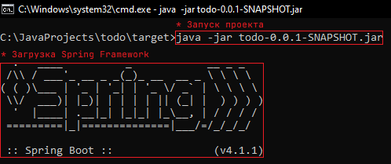
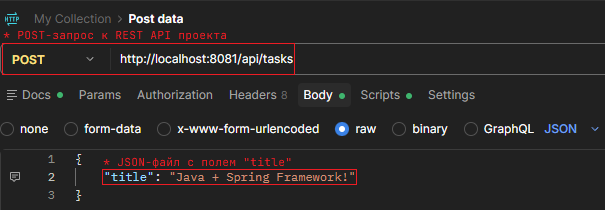
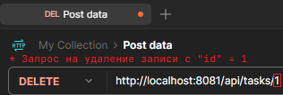

# Проект: «Todo Application»
### 📄 Краткое описание
- Обрабатывает входящие POST, DELETE и GET запросы с помощью REST API
### ✔️ Ключевые возможности
1. Возвращает весь список задач
2. Добавляет новую задачу с автоматическим полем id
3. Удаляет задачу по указанному id
### 📷 Демонстрация работы
- *Процесс запуска проекта в cmd:*

    

- *Отправка POST-запроса через Postman:*

    

- *Отправка GET-запроса через Postman:*

    

- *Отправка DELETE-запроса через Postman:*

    

- *Повторная отправка GET-запроса через Postman:*

    
### ⚙️ Элементы кода
- *Объект для автоматического создания таблицы (Task.java):*
```java
@Entity
public class Task {
    @Id
    @GeneratedValue(strategy = GenerationType.IDENTITY)
    private long id;
    private String title;
    private boolean completed;

    public Task() {}

    public Long getId() { return id; }
    public String getTitle() { return title; }
    public boolean isCompleted() { return completed; }

    public void setId(Long id) { this.id = id; }
    public void setTitle(String title) { this.title = title; }
    public void setCompleted(boolean completed) { this.completed = completed; }
}
```
- *Интерфейс для автоматической генерации SQL-запросов (TaskRepository.java):*
```java
public interface TaskRepository extends JpaRepository<Task, Long> { }
```
- *Обработка запросов (TaskController.java):*
```java
@RestController
@RequestMapping("/api/tasks")
public class TaskController {
    private final TodoRepository repository;

    public TaskController(TodoRepository repository) {
        this.repository = repository;
    }

    // Get all tasks
    @GetMapping
    public List<Task> getAllTasks() {
        return repository.findAll();
    }

    // Create new task
    @PostMapping
    public Task createTask(@RequestBody Task task) {
        return repository.save(task);
    }

    // Delete task by id
    @DeleteMapping("/{id}")
    public void deleteTask(@PathVariable Long id) {
        repository.deleteById(id);
    }
}
```
### 📊 Минимальные системные требования
- *Аппаратные:*
  1. **ОЗУ:** 4 ГБ.
  2. **Процессор:** Intel Core (i3/i5/i7), AMD Ryzen, Apple Silicon (M1/M2/M3)
  3. **Место на диске:** 1-2 ГБ.
- *Программные:*
  1. **ОС:** Windows (10/новее), Mac (X/новее), Linux (любой дистрибутив)
  2. **JDK:** 21+
### 📥 Установка
- *Исходный код:*
  1. **Скопировать** HTTP-адрес репозитория
  2. **Открыть** нужную папку
  3. **Запустить** Git Bash и ввести: git clone "HTTP-адрес из пункта 1"
  4. **Открыть** проект в любой IDE
- *JAR-файл:*
  1. Скоро заполню
### ▶️ Запуск
- *Исходный код (в IDE):*
  1. Через кнопку: **запустить** файл **TodoApplication.java**
  2. Через консоль: **./mvnw spring-boot:run**
- *JAR-файл (в консоли):*
  1. **Переходите** в нужную папку: **cd путь/к/папке/с/JAR-файлом**
  2. **Вводите** команду: **java -jar имя-файла.jar**
  3. **Ожидаете** полного запуска Spring Boot
  4. **После чего:** с проектом можно работать
  5. **Примечание:** чтобы остановить проект необходимо нажать: Ctrl + C
### 🛠️ Технологический стек
 - **JDK 21:** 0.12.1
 - **Spring Boot:** 4.1.1
 - **Maven:** 4.0.0
 - **H2 Database**

### ✉️ Обратная связь:
- **Электронная почта:** sozleks.dev@gmail.com
- **Профиль в VK:**

    

- **Профиль в Reddit:** u/Sozleks